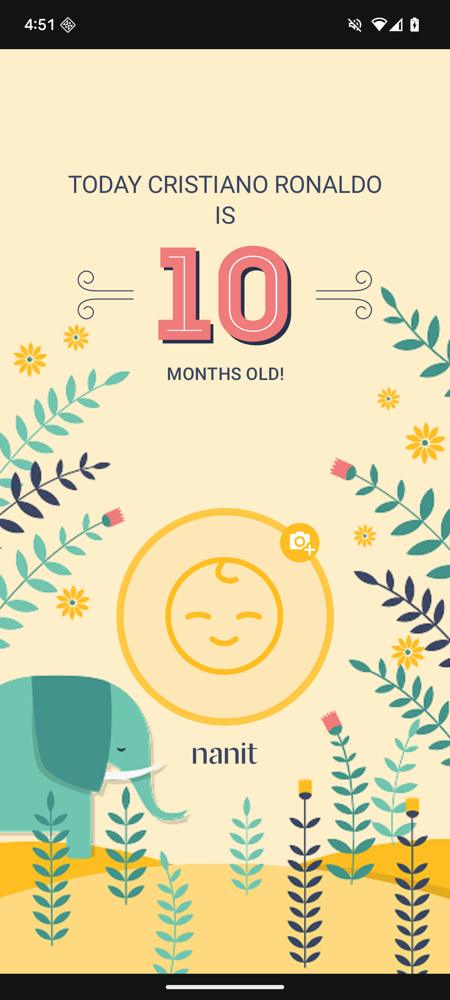
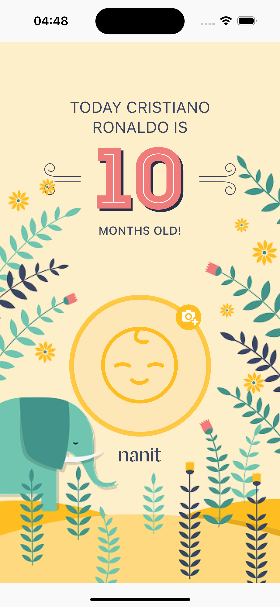
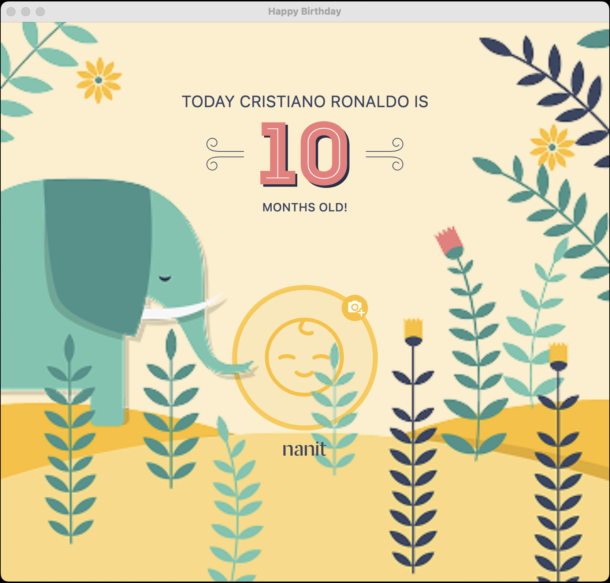

# 🎂 Happy Birthday KMP - Cross-Platform App Development Made Easy with Kotlin Multiplatform


## 🚀 Introduction

Happy Birthday KMP is a Kotlin Multiplatform (KMP) showcase that demonstrates how to write shared
application logic and UI across Android, iOS, and Desktop platforms from a single codebase.

## ✨ Key Features

    📱 Cross-Platform Support
    Runs natively on Android, iOS, and Desktop (via Compose Multiplatform).

    🔁 Shared Logic Layer
    Reuse business logic, networking, models, and more using the Kotlin shared module.

    🎨 UI with Compose Multiplatform
    Jetpack Compose for Android and Desktop; easily pluggable with SwiftUI for iOS.

    ⚙️ Popular Libraries Integrated
        Ktor for networking
        Kotlinx Serialization for data parsing
        Compose Multiplatform for UI

    💡 Modular & Extensible
    Clean project structure ready to be extended into a production app or integrated into an existing codebase.

## 🛠️ Installation & Setup

### Prerequisites

- **JDK 17** installed
- **Android SDK** set in `local.properties`
- **[KDoctor](https://github.com/Kotlin/kdoctor)** to verify environment
- **Xcode** (for iOS) and **Android Studio** (for Android/Web/Desktop)

### Setup

```bash
git clone https://github.com/siarhei-luskanau/happy-birthday-kmp.git
cd happy-birthday-kmp
./gradlew doctor
```

Create a `local.properties` file with:

```properties
sdk.dir=/path/to/your/Android/Sdk
```

Add `SERVER_HOST` and `SERVER_PORT` variables to the `local.properties` file:

```properties
SERVER_HOST=127.0.0.1
SERVER_PORT=8080
```

## 🛠 Running the App

### Android

To run the application on android device/emulator:

 - open project in Android Studio and run imported android run configuration

To build the application bundle:

 - run `./gradlew :composeApp:assembleDebug`
 - find `.apk` file in `composeApp/build/outputs/apk/debug/composeApp-debug.apk`
 Run android UI tests on the connected device: `./gradlew :composeApp:managedVirtualDeviceDebugAndroidTest -Pandroid.testoptions.manageddevices.emulator.gpu=swiftshader_indirect`

### Desktop

 Run the desktop application: `./gradlew :composeApp:run`
 Run the desktop **hot reload** application: `./gradlew :composeApp:jvmRunHot`)
 Run desktop UI tests: `./gradlew :composeApp:jvmTest`

### iOS

To run the application on iPhone device/simulator:

 - Open `iosApp/iosApp.xcproject` in Xcode and run standard configuration
 - Or use [Kotlin Multiplatform Mobile plugin](https://plugins.jetbrains.com/plugin/14936-kotlin-multiplatform-mobile) for Android Studio
 Run iOS simulator UI tests: `./gradlew :composeApp:iosSimulatorArm64Test`

### Screenshot Testing

 Record a screenshot: `./gradlew recordRoborazziDebug`
 Output directory is `screenshots/`

## 📸 Screenshots

|                    Android                    |                  iOS                  |                    Desktop                    |
|:---------------------------------------------:|:-------------------------------------:|:---------------------------------------------:|
|  |  |  |

## 📄 License

This project is distributed under the terms of the MIT License.

## ⭐️ Show Your Support

If you found this project helpful or inspiring, give it a ⭐️!
Your support helps grow the Kotlin Multiplatform community and encourages further development.